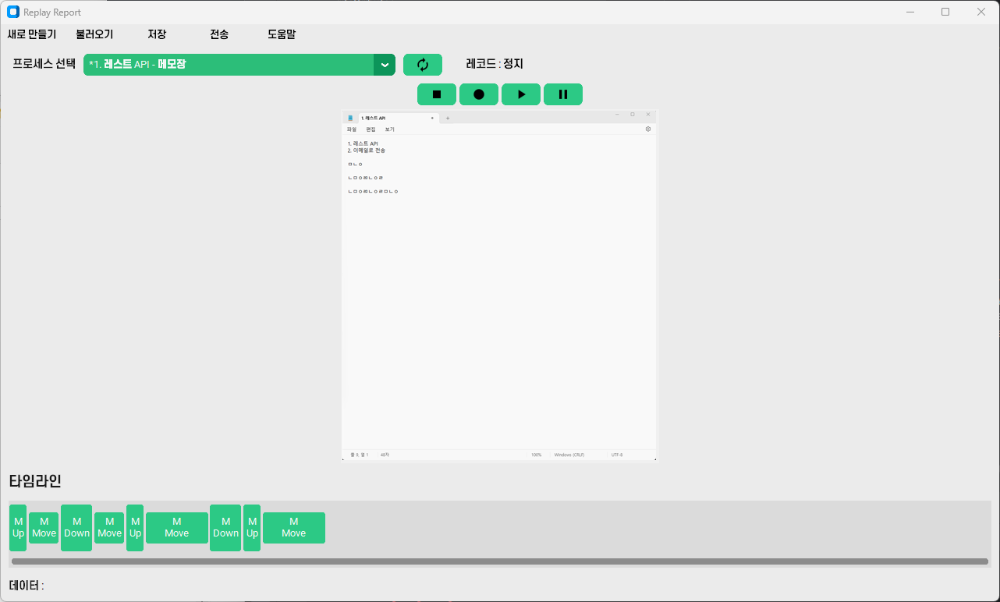

# Replay Reporter(리플레이 리포터)
  
**Replay Reporter is a tool that records user input patterns to help developers reproduce issues occurring in the user's environment on the developer's system.**  
*리플레이 리포터는 사용자의 조작 인풋 패턴을 기록하여, 사용자의 환경에서 발생한 문제를 개발자의 환경에서 재현할 수 있도록 도와주는 도구입니다.*  
 

* * *